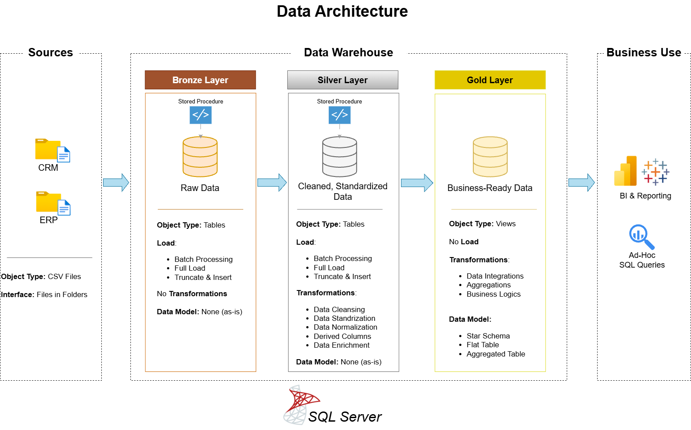

# 🏢 Sales Analytics Data Warehouse Project
### A Modern Medallion-Architecture Warehouse Built in SQL Server

---

## 🚀 Executive Summary

The business operated multiple systems (CRM + ERP) for customers, products, and sales — but reporting teams struggled with **inconsistent data, siloed systems, and no single source of truth**.

So I designed and built a **SQL-based Data Warehouse** using the **Medallion Architecture (Bronze → Silver → Gold)** to consolidate, cleanse, and model this data into a **reliable analytics platform**.

This enables leadership to confidently answer:

**✔ Who are our most valuable customers?  
✔ What drives revenue growth?  
✔ How do trends vary by product, region, and time?**

The result is a **clean, governed Star Schema** that powers fast, trusted BI reporting and decision-making.

---

## 📑 Table of Contents
- [Project Summary](#-project-summary)
- [Business Context](#-business-context)
- [Solution Architecture](#-solution-architecture-medallion-design)
- [Data Cleaning & Transformation](#-data-cleaning--transformation)
- [Star Schema Model](#-star-schema-model)
- [Analytics & Insights](#-analytics--insights)
- [Business Impact](#-business-impact)
- [Tools & Skills](#-tools--skills)

---

## 🔍 Project Summary

This project integrates **CRM and ERP data** into a centralized **SQL Server Data Warehouse**, following the Medallion pattern:

✔ Bronze — Raw data ingestion  
✔ Silver — Cleansed & standardized tables  
✔ Gold — Business-ready Star Schema  

The warehouse supports analytics across:

📈 revenue trends  
🧍 customer value  
📦 product performance  
🌍 geography  

---

## 🏢 Business Context

**Problem**

- Data scattered across systems  
- Inconsistent formats & quality issues  
- Manual reporting processes  
- No single definition of “truth”

**Business Need**

Create a **governed data model** that improves reporting reliability and enables insight-driven decisions.

Key stakeholders included:

✔ Executives  
✔ Sales & Marketing  
✔ Finance  
✔ Data & BI teams  

---

## 🏗 Solution Architecture (Medallion Design)

### 🥉 Bronze — Raw Layer
Stores source data **as-is** for traceability  
> Intent: preserve original structure for audit & validation

### 🥈 Silver — Cleansed Layer
Applies quality and business rules  
> Intent: transform messy inputs into **trusted datasets**

Includes:
- key validation  
- format standardization  
- deduplication  
- lookup normalization  

### 🥇 Gold — Analytics Layer
Business-ready **Star Schema**
> Intent: deliver fast, intuitive BI & reporting

---

## 🧹 Data Cleaning & Transformation

All transformations were designed with **business meaning first** — not just technical processing.

### 🧩 Customer Data
Goal: **accurate, readable profiles**
- normalized fields  
- resolved duplicates  
- cleaned text  
Result → **trusted customer dimension**

### 📦 Product Data
Goal: **stable product tracking**
- applied hierarchy & categories  
Result → **consistent product reporting**

### 📈 Sales Data
Goal: **financial accuracy**
- validated revenue logic  
- converted date formats  
Result → **reliable revenue metrics**

### 🌍 Location Data
Goal: **regional reporting**
- standardized geography labels  
Result → **clean country dimension**

---

## ⭐ Star Schema Model

**Fact** `fact_sales`

**Dimensions** `dim_customer` `dim_product` `dim_category` `dim_location` `dim_date`

---

## 📊 Analytics & Insights

The model supports analysis such as:

📌 top-performing products  
📌 revenue by region  
📌 high-value customers  
📌 time-based trends  

Turning raw transactional data into **business intelligence**.

---

## 💡 Business Impact

This warehouse enables the organization to:

✅ Move from siloed data → single source of truth  
✅ Improve reporting speed & reliability  
✅ Standardize financial definitions  
✅ Support scalable BI infrastructure  

---

## 🛠 Tools & Skills

- SQL Server  
- ETL / Data Pipelines  
- Medallion Architecture  
- Star Schema Modelling  
- Data Quality Engineering  
- SQL Scripting & Stored Procedures  

---

📌 This project demonstrates **business-first analytics engineering — where the real goal is smarter decisions, not just cleaner data.**
